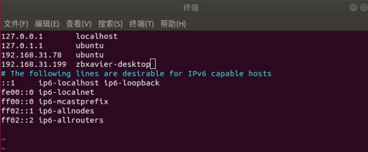

# 嘉喆的实验

1. 硬件：NX+realsense（ldd的NX+曾静的飞机）

2. 启动动捕和octomap

   ```bash
   $ cd map_get
   $ roslaunch realsense_to... realsense_octomap...
   ```

3. NX飞行需用C++版本代码，注意改变平衡位置油门

4. rostopic for multiple machines 不要使用官网教程，修改/etc/hosts和~/.bashrc，需重启终端。

   

   ```bash
   # 主
   export ROS_HOSTNAME=ubuntu ＃ubuntu hostname 
   export ROS_MASTER_URI=http://ubuntu:11311
   # 从
   export ROS_HOSTNAME=zbxavier ＃从机用户名 
   export ROS_MASTER_URI=http://ubuntu:11311 # 主机 URI
   ```

==做仿真实验时需要修改bashrc，取消主从机，否则无法监听topic==
